# Network Traffic Classification

Universal machine learning framework for network traffic classification. Supports multiple datasets, configurable ML models, and automated comparison of different model configurations.

## Features

- **Multiple datasets support**: DDoS detection, Tor traffic detection, application classification
- **Three ML algorithms**: Random Forest, XGBoost, SVM
- **Flexible configuration**: Separate configs for datasets and model parameters
- **Batch processing**: Run multiple model configurations automatically
- **Automated visualizations**: Confusion matrices, feature importance, model comparison charts
- **Classification types**: Binary, multiclass, or both depending on dataset

## Project Structure

```
.
├── main.py                 # Main entry point
├── classifiers.py          # ML model wrappers
├── data_utils.py           # Data loading and preprocessing
├── plots.py                # Visualization functions
├── requirements.txt        # Python dependencies
├── datasets/
│   └── datasets.json       # Dataset configurations
├── models/                 # Model configurations
│   ├── model_base.json       # Default parameters
│   ├── model_fast_test.json      # Quick testing
│   ├── model_high_estimators.json
│   ├── model_regularized.json
│   └── model_linear_svm.json
├── data/                   # CSV data files (not included)
└── results/                # Generated results and plots
```

## Installation

```bash
pip install -r requirements.txt
```

## Quick Start

```bash
# List available datasets
python main.py --list-datasets

# List available model configurations
python main.py --list-models

# Run analysis with all model configs
python main.py -d ddos

# Run with smaller dataset for testing
python main.py -d darknet_tor -s
```

## Usage

### Basic Commands

```bash
# Single model configuration
python main.py -d ddos -c base

# Multiple configurations
python main.py -d ddos -c base fast_test regularized

# Specific ML models only
python main.py -d ddos -m rf xgb

# Custom output directory
python main.py -d ddos -o results/experiment1

# Quiet mode (less output)
python main.py -d ddos -q
```

### Command Line Arguments

| Argument | Short | Description |
|----------|-------|-------------|
| `--dataset` | `-d` | Dataset to analyze |
| `--smaller` | `-s` | Use smaller dataset for quick testing |
| `--config` | `-c` | Specific model config(s) to use |
| `--models` | `-m` | ML models to use (rf, xgb, svm) |
| `--models-dir` | | Directory with model configs (default: models/) |
| `--datasets-config` | | Path to datasets config |
| `--output-dir` | `-o` | Output directory |
| `--list-datasets` | `-ld` | List available datasets |
| `--list-models` | `-lm` | List model configurations |
| `--quiet` | `-q` | Reduce output verbosity |

## Datasets

| Dataset | Type | Description |
|---------|------|-------------|
| `ddos` | binary + multiclass | DDoS attack detection (BENIGN vs ATTACK + attack types) |
| `darknet_tor` | multiclass only | Darknet traffic detection (Tor, Non-Tor, VPN, Non-VPN) |
| `darknet_app` | multiclass only | Application classification (AUDIO, VIDEO, CHAT, etc.) |
| `syscallsbinders` | multiclass only | Syscalls binders classification (malware analysis) |

## Results

### Summary

All models were tested with 5 configurations: Baseline, Fast Test, High Estimators, Linear SVM Focus, and Regularized. Below are the best results achieved for each dataset.

#### Best Results Overview

| Dataset | Best Model | Config | Type | Accuracy | F1-Score |
|---------|-----------|--------|------|----------|----------|
| DDoS (Binary) | XGBoost | High Estimators | Binary | **99.99%** | 0.9999 |
| DDoS (Multiclass) | XGBoost | Baseline | Multiclass | **92.70%** | 0.9295 |
| Darknet Tor | XGBoost | High Estimators | Multiclass | **98.50%** | 0.9850 |
| Darknet App | XGBoost | Baseline | Multiclass | **98.49%** | 0.9845 |
| Syscallsbinders | XGBoost | Baseline | Multiclass | **94.57%** | 0.9456 |

---

### DDoS Attack Detection

Binary classification (BENIGN vs ATTACK) and multiclass classification (attack type detection).

#### Binary Classification Results

| Config | Random Forest | XGBoost | SVM |
|--------|---------------|---------|-----|
| Baseline | 99.98% | 99.98% | 99.87% |
| Fast Test | 99.97% | 99.95% | 99.87% |
| High Estimators | 99.98% | **99.99%** | 99.87% |
| Regularized | 99.96% | 99.97% | 99.83% |
| Linear SVM | 99.98% | 99.98% | 99.88% |

#### Multiclass Classification Results

| Config | Random Forest | XGBoost | SVM |
|--------|---------------|---------|-----|
| Baseline | 89.40% | **92.70%** | 86.99% |
| Fast Test | 88.56% | 92.58% | 86.92% |
| High Estimators | 89.38% | 92.67% | 86.99% |
| Regularized | 89.27% | 92.68% | 86.77% |
| Linear SVM | 89.40% | 92.70% | 87.95% |

#### Visualizations

<details>
<summary>📊 Click to expand DDoS visualizations</summary>

**Class Distribution:**

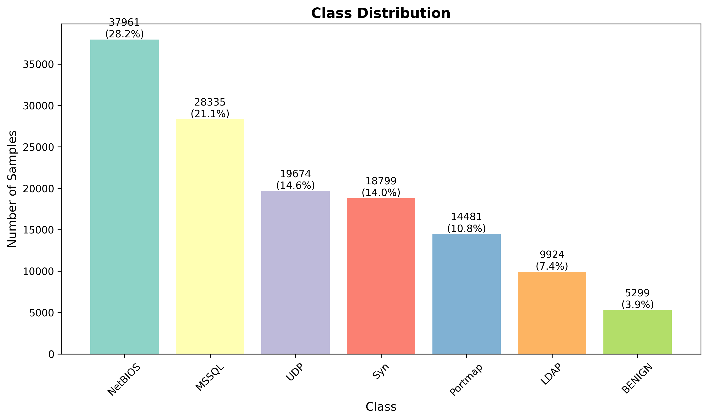

**Model Comparison:**

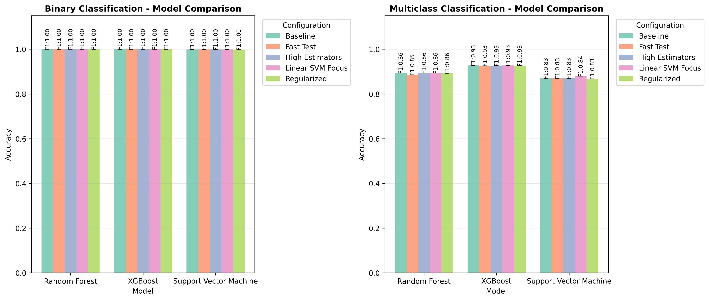

**Confusion Matrices (Baseline):**

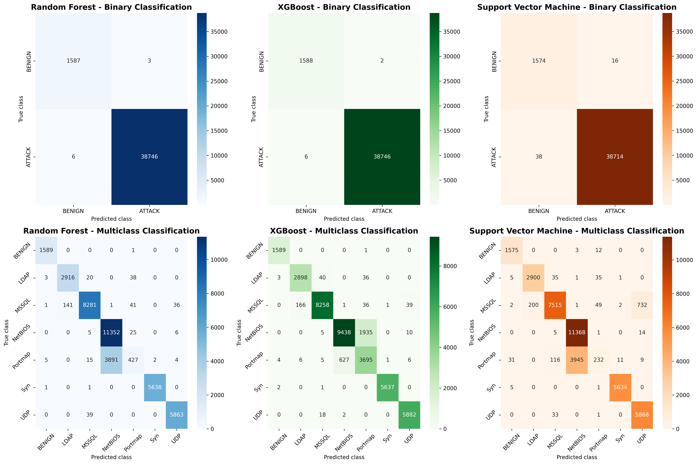

**Feature Importance (Baseline):**


</details>

---

### Darknet Traffic Detection (Tor)

Multiclass classification: Tor, Non-Tor, VPN, Non-VPN traffic.

#### Results by Configuration

| Config | Random Forest | XGBoost | SVM |
|--------|---------------|---------|-----|
| Baseline | 98.37% | 98.49% | 94.89% |
| Fast Test | 97.67% | 97.40% | 94.89% |
| High Estimators | 98.26% | **98.50%** | 94.89% |
| Regularized | 98.25% | 98.31% | 94.04% |
| Linear SVM | 98.37% | 98.49% | 91.17% |

#### Visualizations

<details>
<summary>📊 Click to expand Darknet Tor visualizations</summary>

**Class Distribution:**

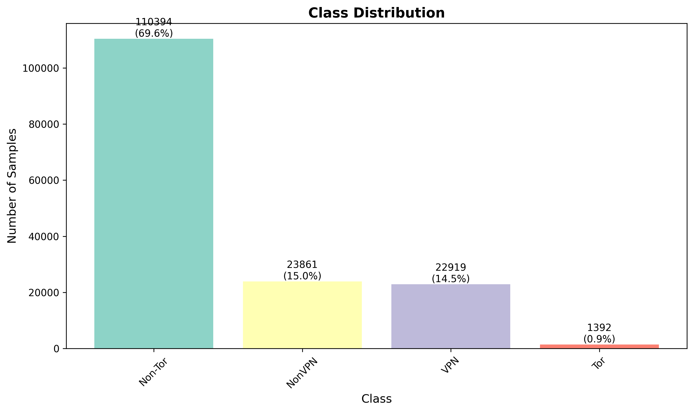

**Model Comparison:**

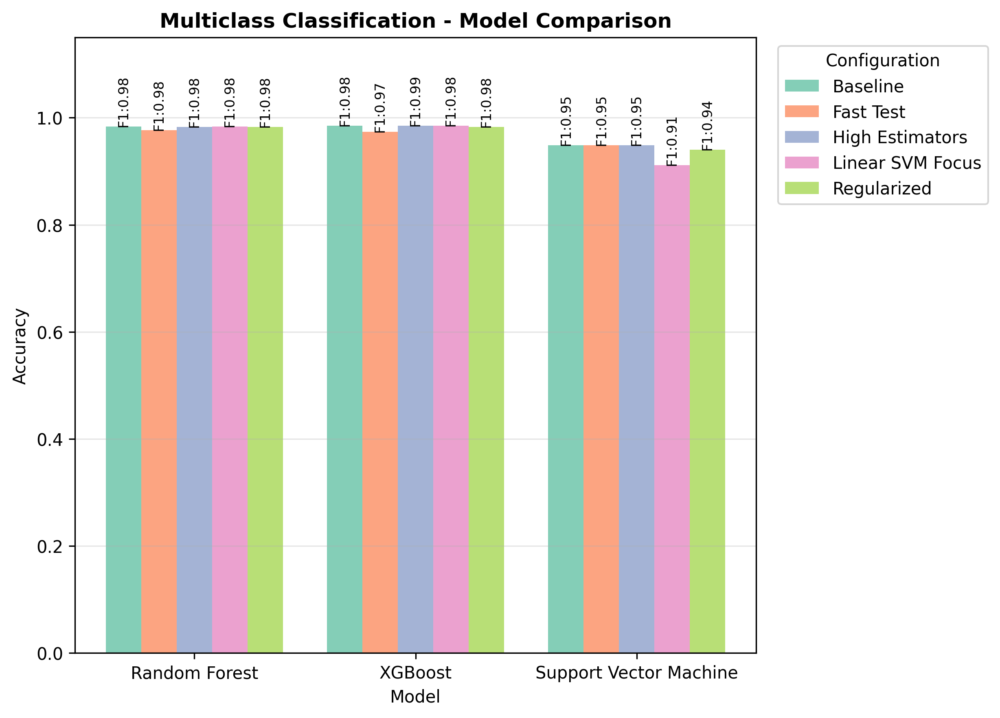

**Confusion Matrices (Baseline):**

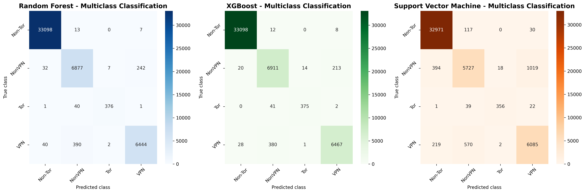

**Feature Importance (Baseline):**

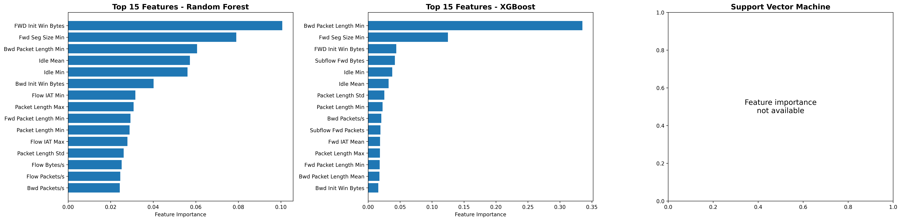

</details>

---

### Darknet Application Classification

Multiclass classification: AUDIO, VIDEO, CHAT, BROWSING, etc.

#### Results by Configuration

| Config | Random Forest | XGBoost | SVM |
|--------|---------------|---------|-----|
| Baseline | 98.43% | **98.49%** | 95.96% |
| Fast Test | 97.43% | 98.15% | 95.91% |
| High Estimators | 98.40% | 98.47% | 95.96% |
| Regularized | 97.96% | 98.25% | 95.77% |
| Linear SVM | 98.43% | 98.49% | 94.46% |

#### Visualizations

<details>
<summary>📊 Click to expand Darknet App visualizations</summary>

**Class Distribution:**

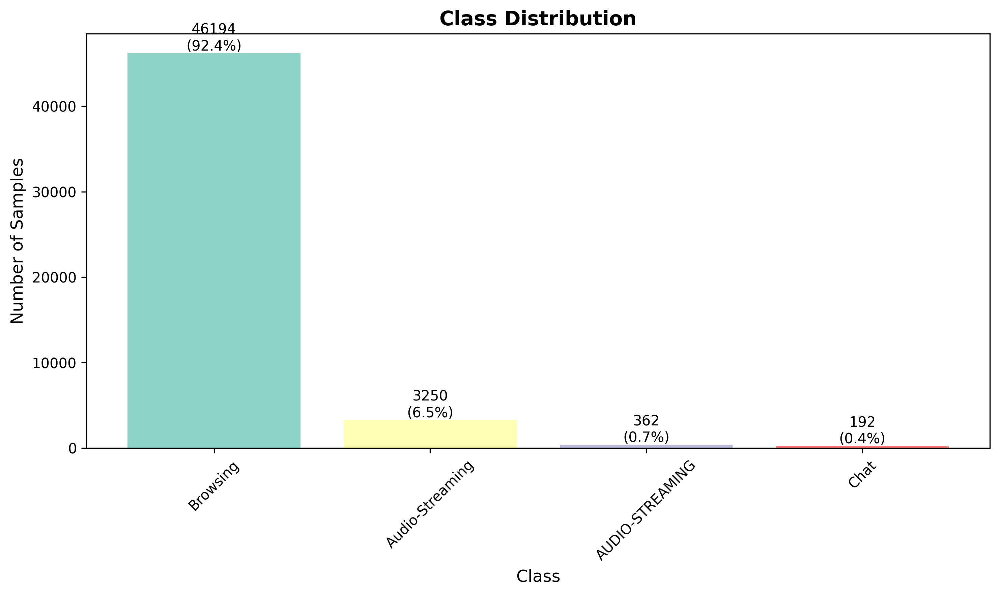

**Model Comparison:**


**Confusion Matrices (Baseline):**

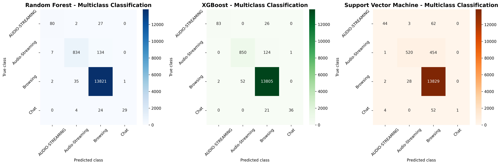

**Feature Importance (Baseline):**


</details>

---

### Syscalls Binders Classification

Multiclass classification of syscalls/binders patterns for malware analysis.

#### Results by Configuration

| Config | Random Forest | XGBoost | SVM |
|--------|---------------|---------|-----|
| Baseline | 94.51% | **94.57%** | 78.16% |
| Fast Test | 91.29% | 92.70% | 77.84% |
| High Estimators | 94.08% | 94.57% | 78.16% |
| Regularized | 93.05% | 94.08% | 76.32% |
| Linear SVM | 94.51% | 94.57% | 86.52% |

#### Visualizations

<details>
<summary>📊 Click to expand Syscallsbinders visualizations</summary>

**Class Distribution:**

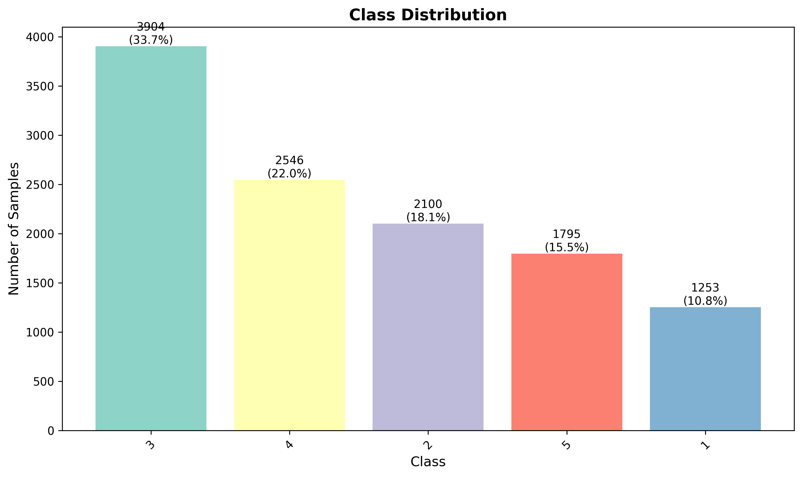

**Model Comparison:**

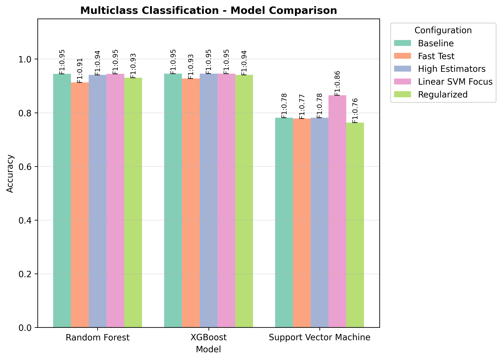

**Confusion Matrices (Baseline):**

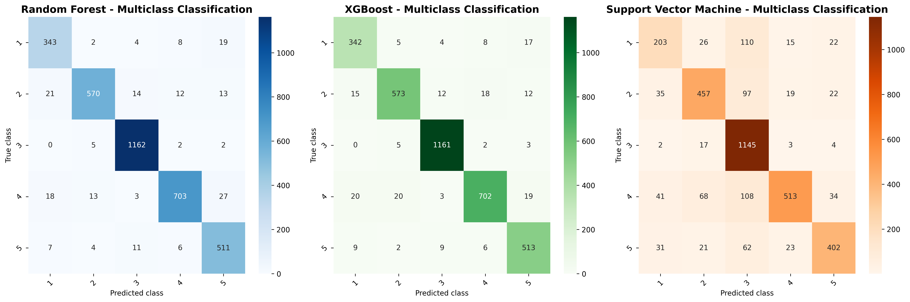

**Feature Importance (Baseline):**


</details>

---

### Key Findings

1. **XGBoost consistently outperforms** other models across all datasets
2. **Tree-based models (RF, XGBoost)** achieve >94% accuracy on all tasks
3. **SVM performance varies** significantly depending on kernel choice (Linear vs RBF)
4. **DDoS binary classification** achieves near-perfect accuracy (99.99%)
5. **Network traffic classification** (Darknet) performs extremely well (~98.5%)

### Adding New Datasets

Edit `datasets/datasets.json`:

```json
{
  "my_dataset": {
    "name": "My Custom Dataset",
    "files": ["data/mydata.csv"],
    "files_smaller": ["data/mydata_smaller.csv"],
    "label_column": "Label",
    "binary_positive_class": "NORMAL",
    "binary_labels": ["NORMAL", "ANOMALY"],
    "drop_columns": ["ID", "Timestamp"],
    "column_mapping": {},
    "binary_only": false,
    "multiclass_only": false
  }
}
```

## Model Configurations

Each config in `models/` directory defines:

```json
{
  "name": "Configuration Name",
  "description": "What this config does",
  "preprocessing": {
    "variance_threshold": 0.0,
    "correlation_threshold": 0.95,
    "test_size": 0.3,
    "random_state": 42
  },
  "models": {
    "rf": { "n_estimators": 100, "max_depth": 20, ... },
    "xgb": { "n_estimators": 100, "max_depth": 10, ... },
    "svm": { "C": 1.0, "kernel": "rbf", ... }
  }
}
```

### Available Configurations

| Config            | Description |
|-------------------|-------------|
| `model_base.json` | Default balanced parameters |
| `model_fast_test.json`  | Minimal params for quick testing |
| `model_high_estimators.json` | More trees for potentially better accuracy |
| `model_regularized.json` | Stronger regularization to prevent overfitting |
| `model_linear_svm.json` | Linear SVM kernel for high-dimensional data |

## Output Files

After running analysis, the following files are generated in `results/<dataset>/`:

| File | Description |
|------|-------------|
| `all_results.csv` | Combined results from all configurations |
| `results_<config>.csv` | Results for specific configuration |
| `confusion_matrices_<config>.png` | Confusion matrix visualizations |
| `feature_importance_<config>.png` | Top 15 important features |
| `class_distribution.png` | Dataset class distribution |
| `model_comparison.png` | Comparison chart (when multiple configs) |

## Data Format

Expected CSV format with network flow features:

- Standard flow features (duration, packet counts, byte counts, etc.)
- Label column for classification target
- Supports CIC-IDS / CIC-DDoS dataset format

## Example Workflow

```bash
# 1. Quick test with fast config
python main.py -d ddos -s -c fast_test

# 2. Full analysis with all configs
python main.py -d ddos

# 3. Compare specific configurations
python main.py -d ddos -c base regularized high_estimators

# 4. Run only tree-based models (faster than SVM)
python main.py -d ddos -m rf xgb
```

## Requirements

- Python 3.8+
- pandas >= 2.0.0
- numpy >= 1.24.0
- scikit-learn >= 1.3.0
- xgboost >= 2.0.0
- matplotlib >= 3.7.0
- seaborn >= 0.12.0
